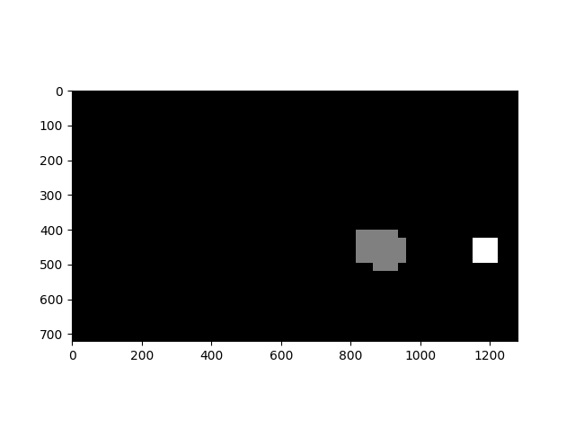
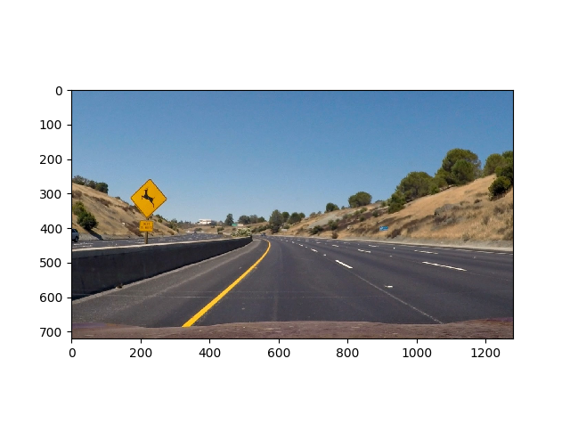
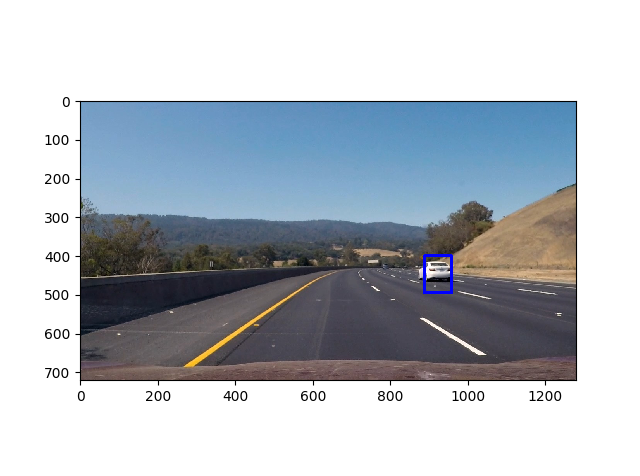

**Vehicle Detection Project**

The goals / steps of this project are the following:

* Perform a Histogram of Oriented Gradients (HOG) feature extraction on a labeled training set of images and train a classifier Linear SVM classifier
* Optionally, you can also apply a color transform and append binned color features, as well as histograms of color, to your HOG feature vector. 
* Note: for those first two steps don't forget to normalize your features and randomize a selection for training and testing.
* Implement a sliding-window technique and use your trained classifier to search for vehicles in images.
* Run your pipeline on a video stream (start with the test_video.mp4 and later implement on full project_video.mp4) and create a heat map of recurring detections frame by frame to reject outliers and follow detected vehicles.
* Estimate a bounding box for vehicles detected.

[//]: # (Image References)
[image1]: ./examples/car_not_car.png

[video1]: ./project_video.mp4

## [Rubric](https://review.udacity.com/#!/rubrics/513/view) Points
###Here I will consider the rubric points individually and describe how I addressed each point in my implementation.  

---

###Histogram of Oriented Gradients (HOG)

####1. Explain how (and identify where in your code) you extracted HOG features from the training images.

The code for this step is contained in the file called `train.py`, function `train()`.  

I started by reading in all the `vehicle` and `non-vehicle` images.  

Here is an example of one of each of the `vehicle` and `non-vehicle` classes:

![alt text][image1]

Then I set up all the variables to extract the features. In the next step I explored different color spaces and different `skimage.hog()` parameters (`orientations`, `pixels_per_cell`, and `cells_per_block`).  I grabbed random images from each of the two classes and displayed them to get a feel for what the `skimage.hog()` output looks like.

<table style="width:100%">
  <tr>
    <th>
      <p align="center">
           
           <br>Hog car
      </p>
    </th>
    <th>
      <p align="center">
           
           <br>Hog not car
      </p>
    </th>
  </tr>
</table>

In the next sections I'll explain why this parameter configuration was chosen.


####2. Explain how you settled on your final choice of HOG parameters.

My final implementation is based on find the best 'accuracy' in the training phase. In order to do so, I tried various combinations of parameters. In the next section I explained which are those parameters.

####3. Describe how (and identify where in your code) you trained a classifier using your selected HOG features (and color features if you used them).

As I described in the last section, I based my approach taking into account the classifier accuracy. I tried a lot of combinations, mainly  of the color space, the # orientations and the HOG pixels per cell, because those parameters are the most important used to characterize the features (based on my experience in the project). For instance, the accuracy playing with the color_space
    #Accuracy: 0.988457207207 = YUV
    #Accuracy: 0.991272522523 = YCrCb <- color space used
    
The following parameters were used to train the classifier (`train.py`).
 
```
    color_space = 'YCrCb' # Can be RGB, HSV, LUV, HLS, YUV, YCrCb
    orient = 11  # HOG orientations
    pix_per_cell = 16 # HOG pixels per cell
    cell_per_block = 2 # HOG cells per block
    hog_channel = 'ALL' # Can be 0, 1, 2, or "ALL"
    spatial_size = (32, 32) # Spatial binning dimensions
    hist_bins = 32    # Number of histogram bins
    spatial_feat = True # Spatial features on or off
    hist_feat = True # Histogram features on or off
    hog_feat = True # HOG features on or off
    y_start_stop = [None, None] # Min and max in y to search in slide_window()

```

###Sliding Window Search

####1. Describe how (and identify where in your code) you implemented a sliding window search.  How did you decide what scales to search and how much to overlap windows?

I decided to search the windows adapting the function `find_cars()` shown in the course. My first step was to apply the search in the entire image, as is depicted in the image below.


####2. Show some examples of test images to demonstrate how your pipeline is working.  What did you do to optimize the performance of your classifier?

Finally I searched on two scales using YCrCb 3-channel HOG features plus spatially binned color and histograms of color in the feature vector, which provided a nice result. As I mentioned above, I tried a lot of combinations, it seems that the color space is the most important parameter in order to disclose cars.

In terms of performance, I noticed that YCrCb makes the classifier performs worst than the YUV color space, however for this project I prefered to find the best accuracy, the performance can be improved changing the HOG channel the pixels per cells... It could be interesting as a future work find the best relation between accuracy and performance playing with the parameters. 

I also noticed that the HOG pixels per cell parameter kills the performance in the training and clasification, I tried to change it from 16 to 8 with the parameters depicted below and it takes six times more than using 16!!! and unfortunately the detection is worst

```
    color_space = 'YCrCb' # Can be RGB, HSV, LUV, HLS, YUV, YCrCb
    orient = 11  # HOG orientations
    pix_per_cell = 8 # HOG pixels per cell <------------ CHANGED
    cell_per_block = 2 # HOG cells per block
    hog_channel = 'ALL' # Can be 0, 1, 2, or "ALL"
    spatial_size = (32, 32) # Spatial binning dimensions
    hist_bins = 32    # Number of histogram bins
    spatial_feat = True # Spatial features on or off
    hist_feat = True # Histogram features on or off
    hog_feat = True # HOG features on or off
    y_start_stop = [None, None] # Min and max in y to search in slide_window()

```

Here are some examples:
<table style="width:100%">
  <tr>
    <th>
      <p align="center">
           
           <br>Image1 window
      </p>
    </th>
      <th>
      <p align="center">
           
           <br>Image2 window
      </p>
    </th>
  </tr>
</table>

---

### Video Implementation

####1. Provide a link to your final video output.  Your pipeline should perform reasonably well on the entire project video (somewhat wobbly or unstable bounding boxes are ok as long as you are identifying the vehicles most of the time with minimal false positives.)

Here's a [link to my video result](./project_video.mp4)


####2. Describe how (and identify where in your code) you implemented some kind of filter for false positives and some method for combining overlapping bounding boxes.

I recorded the positions of positive detections in each frame of the video.  From the positive detections I created a heatmap and then thresholded that map to identify vehicle positions.  I then used `scipy.ndimage.measurements.label()` to identify individual blobs in the heatmap.  I then assumed each blob corresponded to a vehicle.  I constructed bounding boxes to cover the area of each blob detected.  

Here's an example result showing the heatmap from a series of frames of video, the result of `scipy.ndimage.measurements.label()` and the bounding boxes then overlaid on the last frame of video:


Then I applied a hog sub-sampling window search using the techniques/functions described in the course. In this way we extract hog features once in a certain area (cropping the image and extracting the hog features once). 

<p align="center">
  
</p> 

The code used is the practically the same shown in the course, the only thing that I changed is the `cells_per_step` defined, 1 instead of 2. This change captures better the rectangles to be drawn

### Here are six frames and their corresponding heatmaps:

<table style="width:100%">
  <tr>
    <th>
      <p align="center">
           
           <br>Heatmap 1
      </p>
    </th>
      <th>
      <p align="center">
           
           <br>Heatmap 2
      </p>
    </th>
          <th>
      <p align="center">
           
           <br>Heatmap 3
      </p>
    </th>
          <th>
      <p align="center">
           
           <br>Heatmap 4
      </p>
    </th>
          <th>
      <p align="center">
           
           <br>Heatmap 5
      </p>
    </th>
          <th>
      <p align="center">
           
           <br>Heatmap 6
      </p>
    </th>
  </tr>
</table>

### Here is the output of `scipy.ndimage.measurements.label()` on the integrated heatmap from all six frames:
<table style="width:100%">
  <tr>
    <th>
      <p align="center">
           
           <br> Output: 2
      </p>
    </th>
      <th>
      <p align="center">
           
           <br>Output: 0
       </p>
       </th>
      <th>
      <p align="center">
           
           <br>Output: 1
      </p>
    </th>
      <th>
      <p align="center">
           
           <br>Output: 2
      </p>
    </th>
      <th>
      <p align="center">
           
           <br>Output: 2
      </p>
    </th>
      <th>
      <p align="center">
           
           <br>Output: 2
      </p>
    </th>
  </tr>
</table>


### Here the resulting bounding boxes are drawn onto the last frame in the series:
<table style="width:100%">
  <tr>
    <th>
      <p align="center">
           
           <br> Frame 1
      </p>
    </th>
      <th>
      <p align="center">
           
           <br>Frame 2
       </p>
       </th>
      <th>
      <p align="center">
           
           <br>Frame 3
      </p>
    </th>
      <th>
      <p align="center">
           
           <br>Frame 4
      </p>
    </th>
      <th>
      <p align="center">
           
           <br>Frame 5
      </p>
    </th>
      <th>
      <p align="center">
           
           <br>Frame 6
      </p>
    </th>
  </tr>
</table>


---

###Discussion

####1. Briefly discuss any problems / issues you faced in your implementation of this project.  Where will your pipeline likely fail?  What could you do to make it more robust?

Here is a list of the problems that I faced along the realization of this project:
-

The pipeline is probably likely to fail when two cars are very close, it is necessary to bound better the bounding box!. In the same way, there could be problems when there is a car approaching from the front, as it is mentioned above it is ne
As a future work I would like to refine and play with these parameters. 

Here I'll talk about the approach I took, what techniques I used, what worked and why, where the pipeline might fail and how I might improve it if I were going to pursue this project further.  

